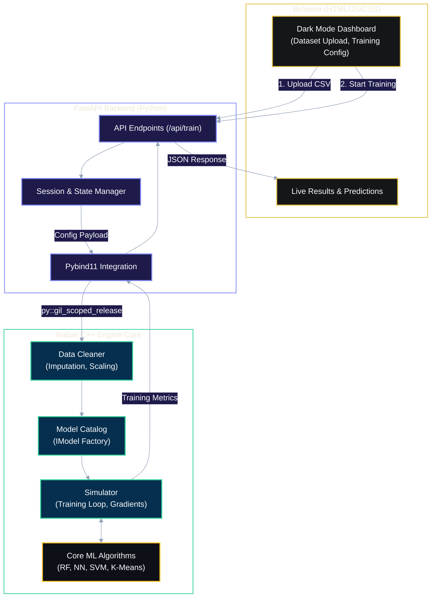
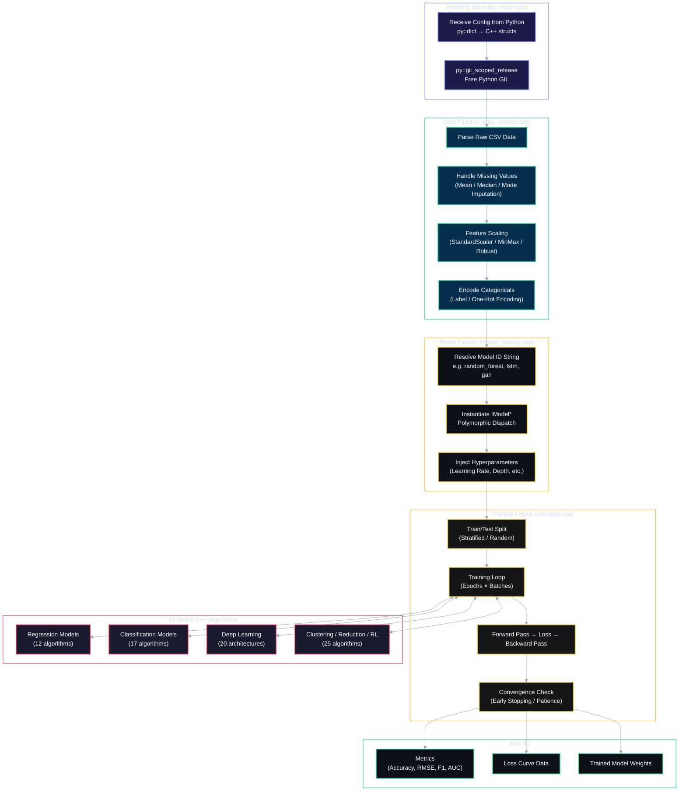
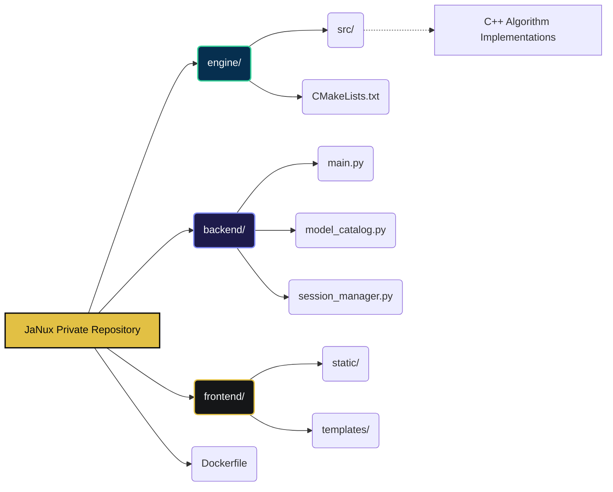

<div align="center">

# JaNux (Architecture & Showcase)

**A High-Performance No-Code Machine Learning & Deep Learning Engine — Native C++ Core, Instant UI**

[](https://janux.onrender.com)
[](#)
[](#)
[](#)
[](#)
[](#)

<br/>

**AEaaS (Algorithmic Engine as a Service)** — *Zero-dependency, high-performance ML compute.*

*JaNux (Just AI, No-code, Unified eXperience)*

*Zero-Dependency Neural Networks · Automated Feature Engineering · C++ Lightning-Fast Training*

*Every machine learning model and neural network operation runs natively in C++. Python and FastAPI handle only orchestration.*

<br/>

[Architecture](#architecture) · [C++ Engine Core](#c-engine-core) · [All 74 Models](#complete-model-catalog-74-algorithms) · [Internal Workflow](#internal-build-workflow)

---

</div>

> [!IMPORTANT]  
> **Public Showcase Repository:** This repository serves as the public documentation and architectural overview for **JaNux**. The actual C++ engine and source code are kept in a private repository to protect the proprietary AEaaS (Algorithmic Engine as a Service) backend. You can test the engine via the [Live Demo](https://janux.onrender.com).

> [!NOTE]
> JaNux trains real machine learning models entirely with native-written C++ algorithms — no PyTorch, TensorFlow, or scikit-learn anywhere in the stack. Python's only job is to run FastAPI and orchestrate the engine.

---

## Table of Contents

<details>
<summary><b>Click to expand</b></summary>

1. [Why JaNux](#why-janux)
2. [Architecture](#architecture)
3. [C++ Engine Core](#c-engine-core)
4. [Complete Model Catalog (74 Algorithms)](#complete-model-catalog-74-algorithms)
5. [Internal Build Workflow](#internal-build-workflow)
6. [Project Structure](#project-structure)

</details>

---

## Why JaNux

Most "no-code ML platforms" are just wrappers around heavy Python libraries that require massive dependencies and slow down execution. JaNux takes a radically different approach:

| Principle | How It's Achieved |
|:---|:---|
| **Transparent & Native** | Every ML algorithm, gradient calculation, and weight update is native-written in C++ — nothing is delegated to a heavy Python framework. |
| **No-Code Interface** | An ultra-premium, matte dark-mode UI allows you to upload datasets, select models, and train them instantly via your browser. |
| **High Performance** | The C++ backend directly executes the math. FastAPI merely acts as the bridge to the user interface, resulting in blazing fast training times. |
| **Complete Pipeline** | From automated data cleaning to hyperparameter tuning, model training, and batch prediction—all handled in a single unified dashboard. |
| **74 Algorithms** | Covers regression, classification, clustering, deep learning (CNNs, RNNs, Transformers, GANs), reinforcement learning, time series, and more — all from scratch in C++. |

---

## Architecture

JaNux is split into two layers: a **compute core** written in C++ that performs all data processing, algorithm execution, and math, and a **web layer** in Python/FastAPI that drives the interactive browser experience.

When you upload a dataset and initiate training, the browser sends the configuration to the FastAPI backend. FastAPI communicates with the compiled C++ engine extension, which loads the dataset into memory and executes the chosen algorithm (Random Forest, Neural Networks, SVMs, etc.) at native speeds.



> [!IMPORTANT]
> **Python does not perform any numerical computation.** The machine learning logic, linear algebra, and optimizations all run natively in C++. Python's role stops at orchestration and serving the API.

---

## C++ Engine Core

The C++ engine contains native-written implementations of **74 machine learning and deep learning algorithms**. Every model implements a common `IModel` interface, allowing the engine to seamlessly hot-swap algorithms during training, prediction, and evaluation without changing the orchestration logic.

### Engine Internal Architecture

The diagram below shows how data flows through the C++ engine internals — from raw CSV input to trained model output:



### How the Engine Works — Step by Step

The C++ engine doesn't just run math; it handles the entire lifecycle of a machine learning workflow independently. Here is what happens when you click "Train":

**Step 1 — Data Ingestion & Cleaning (`data_cleaner.cpp`)**

Raw tabular data is parsed column by column. The cleaner automatically detects data types, fills in missing values using statistical imputation (mean for numeric, mode for categorical), and standardizes features so that all columns are on the same scale. This prevents models like SVMs or Neural Networks from being biased toward features with larger numeric ranges.

**Step 2 — Model Instantiation (`model_catalog.cpp`)**

The catalog acts as a factory. It receives a simple string identifier from the frontend (like `"random_forest"` or `"lstm"`) and dynamically allocates the correct model object. Because every model shares the same `IModel` interface, the engine doesn't need to know which specific algorithm it's creating — it just returns a pointer that the training loop can use.

**Step 3 — Training & Simulation (`simulator.cpp`)**

For iterative algorithms like Neural Networks, Gradient Boosting, and Reinforcement Learning agents, the simulator drives the training loop. It runs forward passes, computes loss, executes backward passes (gradient updates), and checks for convergence. If early stopping is enabled, the simulator monitors validation loss and halts training when improvement stalls.

**Step 4 — Pybind11 Binding (`main.cpp`)**

This is the boundary layer between Python and C++. It takes Python data structures (dictionaries, lists, NumPy arrays), converts them to high-performance C++ structures (`std::vector`, `Eigen` matrices), releases the Python GIL (`py::gil_scoped_release`), and fires the entire C++ training sequence. While C++ crunches numbers, Python's FastAPI remains free to handle other web requests.

### Deep Dive: Why This Is Fast

The C++ engine is engineered for maximum performance, actively avoiding the bottlenecks that plague Python-wrapped libraries.

#### 1. The `IModel` Interface — Polymorphic Dispatch

Every algorithm inherits from a strict `IModel` pure virtual class (`imodel.h`). This enforces a rigid contract:

```cpp
class IModel {
public:
    virtual void train(const std::vector<std::vector<double>>& X, const std::vector<double>& y) = 0;
    virtual std::vector<double> predict(const std::vector<std::vector<double>>& X) = 0;
    virtual std::string serialize() const = 0;
    virtual ~IModel() = default;
};
```

Because of this contract, the orchestration layer does not need to know *what* it is training. It simply requests a pointer from the catalog and invokes `->train()`. You can swap a simple Logistic Regression for a deep Transformer network without changing a single line of orchestration code.

#### 2. Zero-Allocation Hot Loops

Memory allocation (`malloc`/new`) inside a training loop destroys cache locality and kills performance. JaNux strictly follows a **Zero-Allocation Hot Loop** policy:

- **Pre-allocation**: During the constructor phase of any model, all weight matrices, gradient buffers, and activation vectors are allocated exactly once.
- **In-place Mutation**: During forward and backward passes, data is written directly into pre-allocated buffers using pointer arithmetic.
- **Cache Alignment**: Data structures use contiguous memory (`std::vector<double>`) to maximize L1/L2 CPU cache hit rates during matrix multiplications.

#### 3. Manual Gradient Derivation — No Autodiff Overhead

Unlike PyTorch or TensorFlow, which rely on heavy Autograd graphs that consume massive amounts of RAM to track every operation, JaNux uses **native-written mathematical derivatives**.

For algorithms like Neural Networks, the chain rule is pre-computed mathematically and implemented directly into the backward pass in C++.

- **Memory**: The training footprint is exactly `O(N)` where `N` is the number of weights — not `O(N × batch_size × depth)` as required by dynamic computation graphs.
- **Speed**: Backpropagation is pure matrix multiplication without the overhead of traversing a Directed Acyclic Graph (DAG) in memory.

#### 4. The Pybind11 Boundary & GIL Release

Python's Global Interpreter Lock (GIL) is the enemy of concurrent performance. In JaNux, Python is strictly a configuration parser and API server.

When you press "Train", FastAPI receives the JSON payload. Inside `main.cpp`, the engine invokes:

```cpp
py::gil_scoped_release release;
```

The moment this fires, Python is completely unblocked. The C++ engine takes over CPU threads entirely, processing the dataset at native speeds. Meanwhile, FastAPI is free to handle hundreds of other incoming web requests simultaneously. Once the engine finishes, it re-acquires the GIL and returns the results safely to Python.

### Source File Breakdown

The `engine/src/` directory contains all the specialized algorithms broken down by domain:

| Source File | Domain | What It Contains |
|:---|:---|:---|
| `regression_models.cpp` | Regression | Linear, Polynomial, Ridge, Lasso, Elastic Net, SVR, Decision Trees, Random Forest, XGBoost, LightGBM, CatBoost, AdaBoost |
| `classification_models.cpp` | Classification | Logistic Regression, KNN, Naive Bayes (3 variants), SVM (3 kernels), Decision Trees, Random Forest, XGBoost, LightGBM, CatBoost, AdaBoost, LDA, QDA, Perceptron |
| `clustering_models.cpp` | Clustering | K-Means, Hierarchical, DBSCAN, Gaussian Mixture Models, Mean Shift |
| `dim_reduction_models.cpp` | Dim Reduction | PCA, t-SNE, LDA, UMAP, Autoencoder-based reduction |
| `anomaly_models.cpp` | Anomaly Detection | Isolation Forest, One-Class SVM, Local Outlier Factor |
| `advanced_models.cpp` | Deep & Generative | Neural Networks, CNNs (LeNet, AlexNet, VGG, ResNet), RNNs (LSTM, GRU, Bi-directional), Transformers, Autoencoders, VAE, GAN |
| `hybrid.cpp` | Hybrid & RL | CNN-LSTM, LSTM-XGBoost, Autoencoder+Classifier, Q-Learning, DQN, Policy Gradient |
| `data_cleaner.cpp` | Preprocessing | Imputation, Scaling, Encoding, Feature Engineering |
| `model_catalog.cpp` | Factory | Model registry, dynamic instantiation, hyperparameter injection |
| `simulator.cpp` | Training Loop | Epoch management, loss computation, convergence, early stopping |

---

## Complete Model Catalog (74 Algorithms)

JaNux ships with **74 native-written C++ algorithms** spanning every major area of machine learning and deep learning. Every single one runs without PyTorch, TensorFlow, or scikit-learn.

*(See Live Demo for the interactive catalog of all models including Deep Learning, Time Series, Regression, Clustering, and Association Rules).*

---

## Internal Build Workflow

*(Note: Since the engine source is closed, these commands represent the internal deployment pipeline used to serve JaNux)*

```bash
# 1. Build the Native Engine Extension
cd engine
mkdir build && cd build
cmake ..
cmake --build .
cd ../..

# 2. Start the Backend API
pip install -r requirements.txt
uvicorn backend.main:app --reload

# 3. Docker Deployment
docker build -t janux .
docker run -p 8000:8000 janux
```

---

## Project Structure

<details>
<summary><b>Click to expand architecture tree</b></summary>



</details>

---

<div align="center">

### No Black Box. Just Native Math.

*74 from-scratch C++ algorithms · Sleek UI · Automated ML Pipeline*

---

*Engine and Service built by [Anshuman](https://github.com/AnshumanJ28)*

</div>
